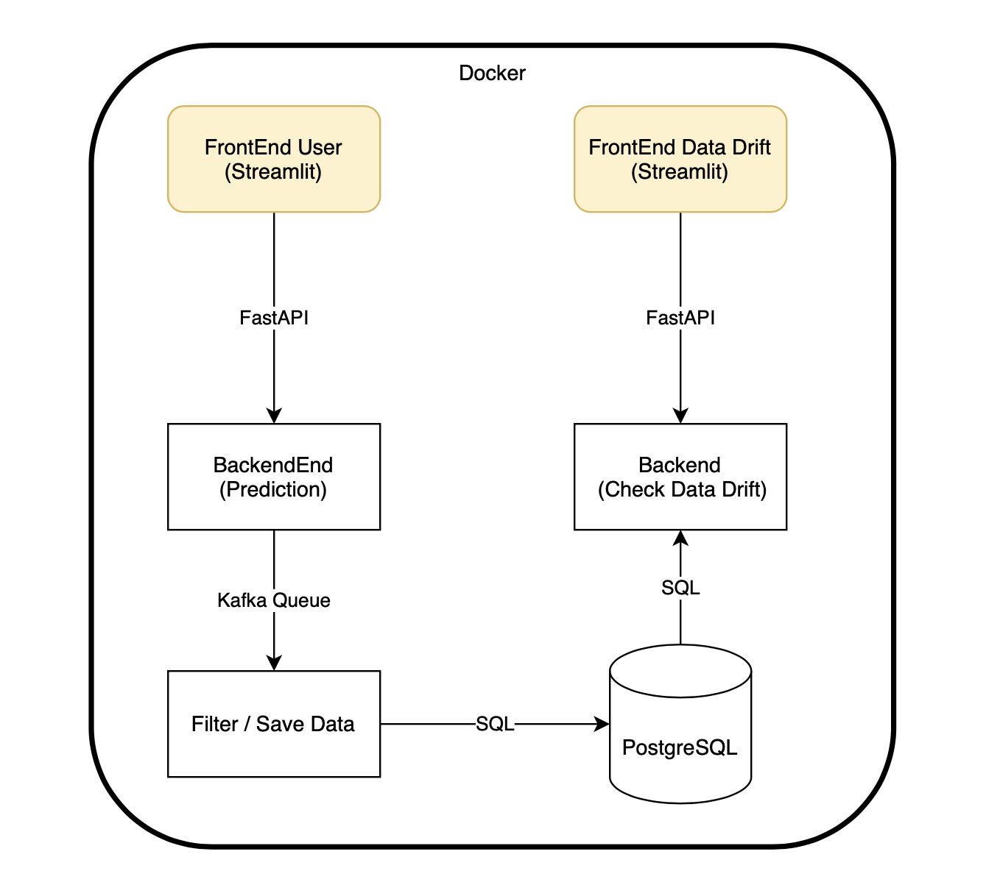

# MLOPS : Red Wine Quality

__AUTEURS__: Moustapha DIOP, Mathieu RIVIER

## Sujet

Dans ce projet vous aurez à mettre en production un modèle de machine learning de votre choix.

Le déploiement du modèle devra se faire automatique via un script simple.

Il faudra que le modèle puisse gérer une certaine charge. Vous pourrez soit faire du batch processing / une API HTTP ou du streaming.

Il faudra que le système soit capable de :
- soit de se réentraîner tout seul régulièrement grâce à des données nouvellement labelisée
- soit de faire remonter des alertes si il existe des risques que le modèle ne marche plus (distributional shift)


*Bonus* : le modèle sera packagé dans un conteneur docker ou sera déployé via Kubernetes / kubeflow

## Architecture



## Lancer le projet

```bash
docker-compose up -d
```

Dans votre navigateur préféré allez à l'adresse :
- *http://localhost:8501* pour lancer vos prédictions.
- *http://localhost:8502* pour vérifier la distribution des donneés.

## Arréter le projet

```bash
docker-compose down
```

## Supprimer les données des containers

```bash
docker-compose rm -svf
```

## Sources

- Dataset : https://www.kaggle.com/datasets/uciml/red-wine-quality-cortez-et-al-2009
- Images :
  - https://www.pinterest.fr/pin/85075880441435976/
  - https://www.google.com/url?sa=i&url=https%3A%2F%2Fwallpaper.dog%2Fwine-red-and-white-wallpapers&psig=AOvVaw1sDha95y11BNYE_pUbyeDt&ust=1670012891233000&source=images&cd=vfe&ved=0CA4QjhxqFwoTCPDS4v2g2fsCFQAAAAAdAAAAABAD
