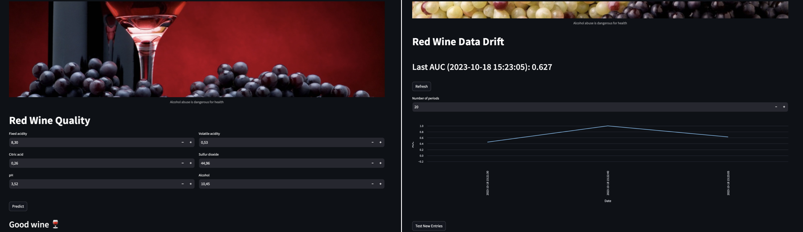
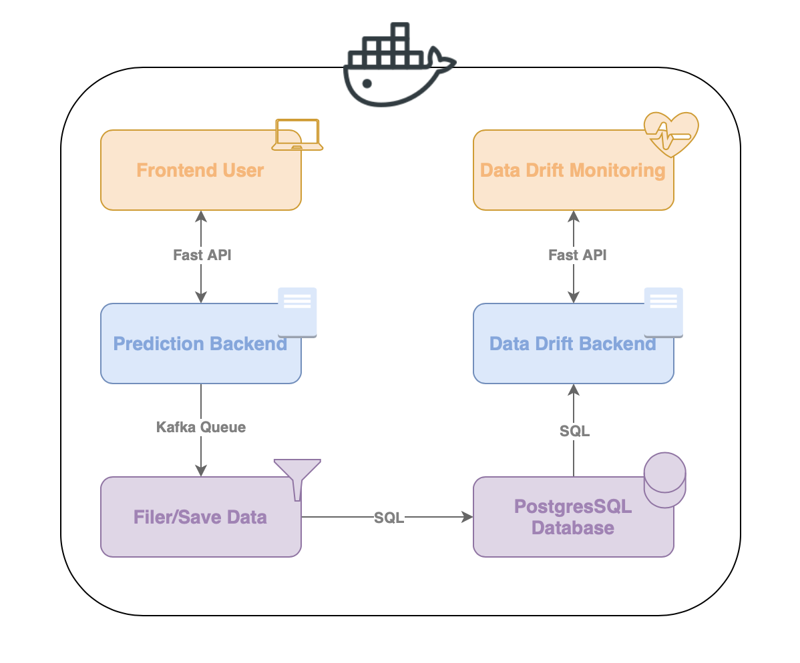

# MLOPS: Red Wine Quality Prediction



Predicting the quality of red wine has never been easier. Welcome to our MLOPS project, where we've built a complete system to predict red wine quality and manage the model effectively. Our goal is not just accurate predictions but to provide a robust system that includes data management, API access, and data drift monitoring using the Eurybia library.

## Project Overview



Our project employs a modular architecture with Docker containers. Each component communicates through sub-networks.

- **Frontend User**: We have a user-friendly front end created with Streamlit. This allows users to input wine information and receive quality predictions. The front end communicates with the prediction backend.

- **Prediction Backend**: This server hosts the machine learning model used for wine quality prediction. After each prediction, the backend returns the results to the user and also sends a copy to the "Filter/Save Data" block via a Kafka queue.

- **Filter/Save Data**: This block reads the Kafka queue, filters data if necessary, and stores all the data in a PostgresSQL database.

- **PostgresSQL Database**: All user data is stored in the PostgresSQL database.

- **Data Drift Monitoring**: We have another Streamlit front end responsible for displaying and alerting if any data drift occurs. This front end communicates with a backend that checks data drift.

- **Data Drift Backend**: This server is responsible for checking data drift. It periodically requests the PostgresSQL database and analyzes the distribution of new data sent by users. If data drift is detected, it sends an alert to the "Data Drift Monitoring" front.


## Getting Started

1. Start the project with the following command:
   ```
   docker-compose up -d
   ```

2. Access the following URLs in your favorite browser:

   - [http://localhost:8501](http://localhost:8501) to run wine quality predictions.
   - [http://localhost:8502](http://localhost:8502) to check for data drift.

3. To stop the project, use the following command:
   ```
   docker-compose down
   ```

4. To delete all data in the containers, use:
   ```
   docker-compose rm -svf
   ```

## Testing Data Monitoring

To test the monitoring of data drift, you can use the following command:

```bash
python send_batch_data.py [-h] {corrupted,normal,noisy}
```

### Command Usage:

#### Positional Arguments:

- `{corrupted,normal,noisy}`: Specifies the type of data to process. You have three options:
    - `corrupted`: Data that does not respect the initial distribution.
    - `normal`: Data that respects the initial distribution.
    - `noisy`: Data that respects the initial distribution but with added noise.

#### Options:

- `-h, --help`: Shows the help message and exits.

Use this command to simulate different data scenarios and test the data monitoring capabilities of the system.

### Example Usage:

To send a batch of normal data for monitoring, use the following command:

```bash
python send_batch_data.py normal
```

For corrupted or noisy data, replace `normal` with `corrupted` or `noisy` accordingly.


## Retraining the Model

To retrain the model, you can use the following command:

```bash
python train_model.py
```

## Resources

- **Dataset**: [Red Wine Quality Dataset](https://www.kaggle.com/datasets/uciml/red-wine-quality-cortez-et-al-2009)

- **Images**:
  - [Pinterest Image](https://www.pinterest.fr/pin/85075880441435976/)
  - [Google Image](https://www.google.com/url?sa=i&url=https%3A%2F%2Fwallpaper.dog%2Fwine-red-and-white-wallpapers&psig=AOvVaw1sDha95y11BNYE_pUbyeDt&ust=1670012891233000&source=images&cd=vfe&ved=0CA4QjhxqFwoTCPDS4v2g2fsCFQAAAAAdAAAAABAD)

- **Libraries**:
  - [Eurybia](https://eurybia.readthedocs.io/en/latest/)
  - [Streamlit](https://streamlit.io/)
  - [Kafka](https://kafka.apache.org/)
  - [PostgresSQL](https://www.postgresql.org/)
  - [Docker](https://www.docker.com/)


__AUTEURS__: Moustapha DIOP, Mathieu RIVIER